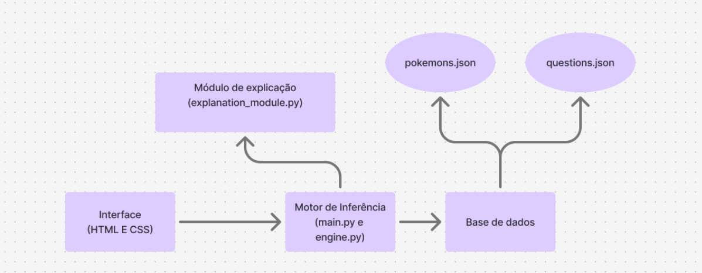

# Sistemas Especialistas — Projeto 1

## Pokénator: Sistema Especialista para Adivinhação de Pokémon

- [Pedro Calderón](https://www.github.com/pedrocalderon52) — RA: 22408377
- [Lucas Alberto Borges](https://www.github.com/Borges070) — RA: 22405351
- [Pedro Henrique Quartin](https://www.github.com/phquartin) — RA: 22408544
- [Isaac Lovisi](https://www.github.com/IsaacLovisi) — RA: 22402080
- [Lucas Mendes](https://www.github.com/lucasocm3021) — RA: 22406802
- [Artur Machado](https://www.github.com/artur-maximo) — RA: 22403701

---

## 1. Introdução

Este relatório apresenta o desenvolvimento do Pokénator, um sistema especialista capaz de inferir qual Pokémon o usuário está pensando a partir de uma sequência de perguntas binárias (sim/não). O sistema foi inspirado no funcionamento do software Akinator, que utiliza perguntas sucessivas para reduzir o espaço de possibilidades até chegar a uma hipótese plausível.

O sistema foi desenvolvido em Python, utilizando o framework Experta, uma biblioteca voltada para construção de sistemas especialistas baseada em motores de inferência com regras e fatos.

A aplicação utiliza uma arquitetura composta por:

- Interface de interação com o usuário
- Motor de inferência
- Base de conhecimento
- Módulo de explicação

Esses componentes trabalham conjuntamente para simular o processo de raciocínio típico de um sistema especialista, conforme ilustrado na arquitetura apresentada na Imagem 1.

---

## 2. Arquitetura do Sistema



*Imagem 1: diagrama de blocos do sistema Pokénator*

A arquitetura do Pokénator segue o modelo clássico de sistemas especialistas, composto por quatro elementos principais:

- Interface de interação
- Motor de inferência
- Base de conhecimento
- Módulo de explicação

Cada um desses componentes possui uma função específica dentro do fluxo de inferência.

---

## 3. Estrutura do Código

O sistema foi implementado de forma modular, separando responsabilidades entre diferentes componentes da aplicação. A seguir são descritos os principais blocos funcionais do sistema.

### 3.1 Interface

A interface é responsável pela interação entre o usuário e o sistema especialista. Ela foi desenvolvida utilizando HTML e CSS, sendo inspirada visualmente em dois sistemas conhecidos:

- o site Pokédle, relacionado ao universo Pokémon
- o próprio Akinator, que serviu como referência conceitual para o projeto

A interface apresenta as perguntas geradas pelo motor de inferência e coleta as respostas do usuário, que podem ser “sim”, “não” ou “não sei”

Essas respostas são então enviadas para o backend do sistema, onde são convertidas em fatos e processadas pelo motor de inferência.


*Imagem 2: Interface gráfica do sistema Pokénator*

### 3.2 Motor de Inferência

O motor de inferência é responsável por processar fatos e aplicar regras para reduzir o conjunto de hipóteses possíveis. Ele foi implementado utilizando o framework Experta, que fornece uma engine baseada em regras de produção. O funcionamento ocorre da seguinte forma:

1. O sistema possui inicialmente um conjunto de Pokémon candidatos possíveis.
2. A cada pergunta respondida pelo usuário, um novo fato é declarado no sistema.
3. O motor de inferência avalia esse fato e filtra os Pokémon incompatíveis com a resposta fornecida.
4. O conjunto de candidatos é progressivamente reduzido.

Esse comportamento pode ser observado no método:

```python
self.engine.declare(Answer(attribute=self.current_attr, value=val))
self.engine.run()
```

Nesse momento, a resposta do usuário é inserida na memória de trabalho do motor, que executa as regras e atualiza o conjunto de possibilidades.

### 3.3 Base de Conhecimento

A base de conhecimento contém as informações estruturadas sobre os Pokémon que podem ser inferidos pelo sistema. Essas informações incluem atributos como:

- cor
- tipo
- habitat
- geração
- características específicas (ex.: lendário, mítico, evoluído)

Cada Pokémon é representado internamente por um mapa de atributos booleanos, permitindo que o sistema realize filtragens lógicas durante o processo de inferência.

No código, isso é construído no método `build_attributes()`. Esse método percorre todos os Pokémon disponíveis e cria um dicionário com seus respectivos atributos, como por exemplo:

- `type_fire`
- `is_legendary`
- `is_color_red`
- `habitat_cave`

Essa representação transforma características semânticas dos Pokémon em variáveis lógicas manipuláveis pelo motor de inferência.

### 3.4 Estratégia de Seleção de Perguntas

Um dos pontos centrais do sistema é o algoritmo de escolha da próxima pergunta a ser feita ao usuário. O Pokénator utiliza duas estratégias distintas:

#### 1. Perguntas iniciais aleatórias

As primeiras perguntas são selecionadas aleatoriamente para evitar que todas as partidas sigam exatamente o mesmo fluxo de perguntas. Essa estratégia melhora a experiência do usuário, introduzindo variação nas primeiras interações.

#### 2. Escolha heurística da melhor pergunta

Após as primeiras interações, o sistema passa a utilizar a função heurística `choose_best_question()`. Essa função seleciona a pergunta que melhor divide o conjunto de Pokémon restantes, maximizando a eficiência da inferência. Na prática, ela procura perguntas que eliminem aproximadamente metade das hipóteses possíveis e reduzam mais rapidamente o espaço de busca. Esse tipo de abordagem é similar ao critério de ganho de informação utilizado em árvores de decisão.

### 3.5 Módulo de Explicação

O módulo de explicação tem como objetivo registrar e tornar transparente o processo de raciocínio do sistema. Esse módulo gera logs que registram:

- qual pergunta foi escolhida
- quantos Pokémon seriam eliminados caso a resposta fosse verdadeira ou falsa
- o motivo da escolha da pergunta

Por exemplo:

```python
log_question_choice(...)
```

Esses registros são posteriormente exibidos na interface, permitindo que o usuário compreenda como o sistema chegou à sua conclusão. Esse componente é importante em sistemas especialistas, pois aumenta a interpretabilidade e confiabilidade do sistema.

---

## 4. Processo de Inferência

O processo completo de inferência do Pokénator ocorre da seguinte maneira:

1. O sistema carrega os dados de Pokémon e perguntas.
2. Inicializa o motor de inferência.
3. Seleciona uma pergunta.
4. Recebe a resposta do usuário.
5. Atualiza os fatos na memória de trabalho.
6. Filtra os Pokémon possíveis.
7. Repete o processo até restar uma ou poucas hipóteses.
8. Quando apenas um Pokémon permanece possível, o sistema apresenta a inferência final.
9. Caso múltiplos Pokémon ainda sejam possíveis, o sistema realiza um chute probabilístico entre os candidatos restantes.

---

## 5. ADRs — Architectural Decision Records (Registro de Decisões Arquiteturais)

### ADR 1 — Utilização de uma base de conhecimento local

**Decisão:**

- Foi adotada uma base de conhecimento local contendo os atributos relevantes dos Pokémon.

**Contexto:**

Os dados utilizados pelo sistema poderiam ser obtidos diretamente da PokeAPI, uma API pública que fornece informações sobre Pokémon. No entanto, consultar a API a cada pergunta geraria:

- maior latência
- dependência de rede
- maior número de requisições externas

**Justificativa:**

Ao manter os dados estruturados localmente, o sistema obtém:

- maior desempenho
- menor tempo de resposta
- maior previsibilidade de execução

Além disso, a estrutura local facilita a construção de atributos booleanos necessários para o processo de inferência.

### ADR 2 — Utilização do framework Experta

**Decisão:**

- Foi escolhido o framework Experta para implementação do motor de inferência.

**Contexto:**

A construção de um sistema especialista requer:

- manipulação de fatos
- aplicação de regras
- gerenciamento da memória de trabalho
- execução de inferência baseada em produção

Implementar manualmente todos esses mecanismos tornaria o sistema significativamente mais complexo.

**Justificativa:**

O Experta oferece uma implementação madura de:

- motores baseados em regras
- gerenciamento de fatos
- execução automática das regras

Isso permitiu concentrar o desenvolvimento no domínio do problema (inferência de Pokémon), em vez de reconstruir toda a infraestrutura de um motor especialista.

---

## 6. Uso de Inteligência Artificial no Desenvolvimento

O código do sistema foi desenvolvido com auxílio de ferramentas modernas de programação assistida por inteligência artificial.

Durante o desenvolvimento foi utilizado o Codex 5.4, modelo da OpenAI integrado ao editor Visual Studio Code, com o objetivo de auxiliar na escrita de código, sugestões de implementação e revisão de estruturas.

Este relatório também contou com apoio de ferramentas de inteligência artificial generativa, utilizadas exclusivamente para melhorar a clareza textual e a organização das ideias. A elaboração do conteúdo partiu de um planejamento próprio, e técnicas de engenharia de prompt — como prompt chaining e manipulação da janela de contexto — foram utilizadas para auxiliar na redação.

Após a geração inicial dos textos, foi realizada uma revisão manual completa, com correções e ajustes conceituais. O modelo utilizado nesse processo foi o GPT-5.2 da OpenAI.

Importante ressaltar que nenhum conteúdo de pesquisa foi obtido diretamente do modelo de linguagem, sendo as fontes acadêmicas utilizadas explicitamente citadas na seção de referências.

---

## 7. Conclusão

O desenvolvimento do Pokénator demonstrou, na prática, os principais conceitos envolvidos na construção de sistemas especialistas baseados em regras. O projeto evidencia como uma base de conhecimento estruturada, aliada a um motor de inferência eficiente, pode ser utilizada para resolver problemas de classificação por meio de perguntas sucessivas. Além disso, a inclusão de um módulo de explicação reforça um dos princípios fundamentais dos sistemas especialistas: a capacidade de justificar o raciocínio utilizado para chegar a uma conclusão.

A abordagem utilizada mostrou-se adequada para o problema proposto, permitindo reduzir progressivamente o conjunto de hipóteses até chegar a uma inferência plausível sobre o Pokémon escolhido pelo usuário.

---

## 8. Referências

- Costa, W. S., & Silva, S. C. M. (2007).  
  Aquisição de conhecimento: o grande desafio na concepção de sistemas especialistas.  
  HOLOS, 2, 37–46.  
  https://doi.org/10.15628/holos.2005.71
- https://pt.akinator.com/game
- https://pokeapi.co/
- https://criticalhits.com.br/anime/todos-os-pokemon-que-ash-capturou-no-anime-em-ordem/
